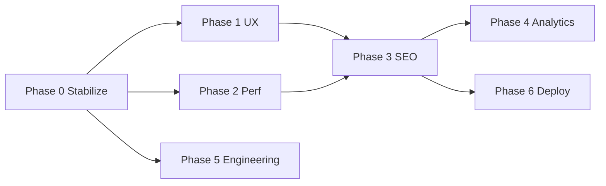

# Precifarm website — improvement & optimization plan

**Date:** 30 September 2026  
**Scope:** `website/` (Next.js 16, precifarm.com)  
**Goal:** Faster, clearer, easier to maintain — without breaking Canon or overstating live traction.

---

## Current baseline

| Area | State |
|------|--------|
| Homepage | Slimmed to 7 sections (scenarios → hub teaser → support → value prop → CTA) |
| Contact | Centralized in `lib/contact.ts` (phone, WhatsApp, email) |
| Static weight | ~186 MB under `public/` (177 tracked files; PDFs + product art dominate) |
| Stack | App Router, Tailwind 4, Leaflet hub map, optional Google Maps |
| SEO | Registry + JSON-LD, CMS-backed FAQ/guides, `llms.txt` |
| Known friction | Dev Turbopack + `@import` in CSS (Leaflet in `layout.tsx`); multiple `next dev` locks; `output: standalone` |

---

## North-star outcomes (12 months)

1. **Visitor understands the offer in &lt;10s** — one story, two paths (charge at home / charge on the road or for business).
2. **Lighthouse mobile ≥90** performance on `/`, `/charging`, `/hub` (lab + field CWV).
3. **Deploy artifact &lt;100 MB** excluding on-demand PDF downloads (or PDFs on CDN).
4. **Single source of truth** for copy (`brand-messaging`, `contact`, product libs) — no drift in PDFs/footer/schema.
5. **Measurable funnel:** hub open → survey start → contact/WhatsApp → CMS lead (analytics already defined in ecosystem docs).

---

## Phase 0 — Stabilize (1–2 days)

**Why:** Stop regressions before UX/perf work.

| Task | Action |
|------|--------|
| Commit pending work | Leaflet CSS fix, homepage slim-down, asset prune, contact number, `PIVOT-CLEANUP.md` |
| Dev hygiene | Document one-server rule; `dev:clean` when ENOTEMPTY on Windows |
| CI gate | `npm run build` on PR; optional `npm run seo:health` |
| Dependency sync | `npm ci` after lockfile changes (Leaflet was missing → 500 in dev) |

**Done when:** Clean clone → `npm ci` → `npm run dev` → `/` returns 200.

---

## Phase 1 — UX & information architecture (1–2 weeks)

**Problem:** Site still *feels* dense on inner pages; homepage improved but `/charging` repeats pillars.

| Priority | Work | Files / routes |
|----------|------|----------------|
| P0 | **Nav simplification** — 4 mental groups (Charging · Energy · For business · Company); one header CTA (`/hub`) | `lib/brand-messaging.ts`, `Header.tsx` |
| P0 | **Home hero** — 2 proof points max (not 3 stats); single hero image (Pulse or ecosystem v21) | `HomeHero.tsx`, `heroStats` |
| P1 | **Pulse & Boda feature bands** on `/` (link out; no full product grid) | New or reuse `HomeChargingCta`-style components |
| P1 | **Status badges** — Available / Concept / Quotation on Corridor, Boda, modular energy | Shared `StatusBadge`, product libs |
| P2 | **Retire unused home components** — `HomeFlagships`, `HomeRangeCompact`, etc., or move to storybook doc | `components/home/*` |
| P2 | **Announcement bar** — one line; hide or shorten on mobile | `HomeAnnouncement.tsx` |

**Canon checklist:** Every DC/corridor/hub claim labelled live vs planned; charge times framed as typical/duty-cycle.

**Review:** Product/marketing sign-off before deploy ([`docs/CANON.md`](../../docs/CANON.md)).

---

## Phase 2 — Performance & weight (1–2 weeks)

**Problem:** ~186 MB `public/` slows clone, deploy, and cold starts; large PNG heroes; PDF HTML duplicates.

| Priority | Work | Expected gain |
|----------|------|----------------|
| P0 | **Image pipeline** — AVIF/WebP via `next/image` everywhere; audit `priority` on LCP only | LCP −200–500 ms |
| P0 | **Move PDF source assets out of `public/`** — keep only shipped PDF/HTML in `public/downloads/`; point generators at `scripts/assets/` or monorepo `docs/product/figures` | −50–80 MB git/deploy |
| P1 | **Lazy hub map** — dynamic import Leaflet/Google on `/hub` only; avoid loading map CSS globally if possible | Smaller global JS |
| P1 | **Font subsetting** — Plus Jakarta weights actually used (500–800); preload only critical | FCP improvement |
| P2 | **Third pass asset prune** — script: `git ls-files public` vs codebase + PDF scripts | Ongoing |
| P2 | **CDN for PDFs** — `NEXT_PUBLIC_*` URL for large engineering PDFs; optional download page only | Faster HTML routes |

**Metrics:** Lighthouse CI on `/`, `/charging/home`, `/hub`; target LCP &lt;2.5s, INP &lt;200ms on 4G.

---

## Phase 3 — SEO, content & trust (ongoing)

| Priority | Work |
|----------|------|
| P0 | Regenerate PDFs if contact/footer phone embedded in static HTML |
| P0 | `npm run verify:cms` after deploy; align CMS seed with Pulse/Boda/Corridor naming |
| P1 | Consolidate duplicate narratives — homepage vs `/charging` (`whereYouCharge` vs `homeScenarios`) |
| P1 | `/evs` + 3 homepage FAQ teasers (optional) without full table on `/` |
| P2 | Kiswahili `/sw` parity audit (off-nav but in sitemap) |
| P2 | Structured data audit — Organization `contactPoint` matches `lib/contact.ts` |

Existing tooling: `seo:health`, `seo:search-console`, `seo:request-indexing`.

---

## Phase 4 — Conversion & analytics (2–4 weeks)

Align with [`docs/analytics/`](../../docs/analytics/README.md).

| Event / metric | Implementation |
|----------------|----------------|
| `website_whatsapp_clicked` / `website_phone_clicked` | Footer + contact page (verify wired) |
| Home scenario clicks | `home_scenario_selected` with scenario id |
| Survey funnel | `/charging/home#survey` → existing survey API |
| Hub engagement | Map filter / site detail opens |

**Dashboards:** Acquisition → hub/survey → contact (per funnel docs).

---

## Phase 5 — Engineering quality (parallel)

| Item | Notes |
|------|--------|
| **Middleware → proxy** | Next 16 deprecation warning; plan migration |
| **Tests** | Restore vitest for `lib/charging`, contact, SEO helpers (was removed in reset) |
| **Agent workspace** | Re-introduce `/agent` engineering UI as separate PR if still desired |
| **Lint** | Triage `npm run lint` noise; eslint on changed files in CI |
| **Accessibility** | Focus order, contrast on charge-green CTAs, map keyboard |

---

## Phase 6 — Deploy & ops

| Task | Detail |
|------|--------|
| Standalone run | Document `node .next/standalone/server.js` vs `next start` for Cloud Run |
| Env | `CMS_API_URL`, `NEXT_PUBLIC_SITE_URL`, maps key optional |
| Post-deploy | `seo:health`, manual `/hub`, contact form → CMS |
| Rollback | Keep previous Cloud Run revision |

---

## Suggested execution order

**Quick wins this week:** commit Phase 0, hero stat reduction, PDF asset relocation design, regenerate PDFs with new phone.

**Progress (30 Sep 2026):** Phase 0–1 shipped in repo (nav, hero, homepage, dev README). Phase 2 started: live hub map on `/hub`, `StatusBadge`, `scripts/pdf-assets/README.md` for PDF source migration.

**Do not batch:** Full homepage redesign + nav change + PDF move in one deploy — ship UX and perf in separate releases.

---

## Ownership & sign-off

| Area | Owner |
|------|--------|
| Copy / Canon | Product + marketing |
| UX mockups | Design (optional Fiverr/industrial brief alignment) |
| Implementation | Web engineering |
| CMS content | CMS team after `verify:cms` |
| Go-live | Product approves status labels on Corridor/hub map |

---

## Related docs

- Ecosystem channel: [`docs/channels/website.md`](../../docs/channels/website.md)
- Pivot inventory: [`PIVOT-CLEANUP.md`](./PIVOT-CLEANUP.md)
- Upgrade notes: [`docs/channels/website-upgrade-2026-08-20.md`](../../docs/channels/website-upgrade-2026-08-20.md)
